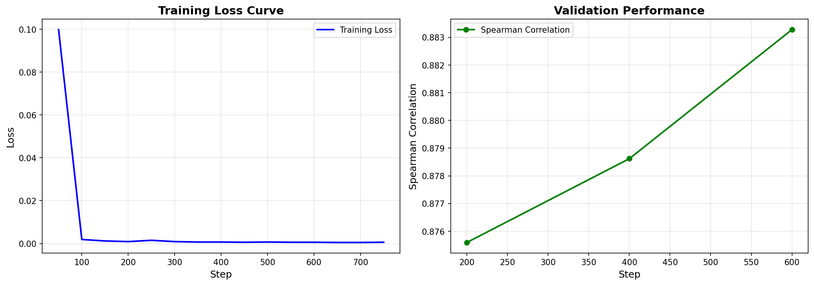

# Scholar Stream: Research Paper Recommendation Service

A research paper recommendation system that uses knowledge distillation to transfer semantic understanding from OpenAI's Ada-002 embeddings to a lightweight Sentence Transformer model.

## Team Details
1. Amirthalingam Rajasundar (amirthaling1@iisc.ac.in)
2. Grampurohit Santosh (santoshvg@iisc.ac.in)

## 1. Problem Statement

Researchers often struggle to discover relevant papers across the vast academic literature. This project builds a recommendation system that:

- **Goal**: Given a paper or search query, find the most semantically similar papers
- **Challenge**: OpenAI's Ada-002 produces excellent embeddings but is expensive for production use ($0.0001/1K tokens)
- **Solution**: Fine-tune a lightweight Sentence Transformer (all-MiniLM-L6-v2) to mimic Ada-002's similarity judgments, enabling free, fast inference at deployment

---

## 2. Data Understanding

### Dataset: ArXiv Papers

- **Source**: [Kaggle ArXiv Dataset](https://www.kaggle.com/Cornell-University/arxiv) by Cornell University
- **Full Size**: ~2.4 million papers across all scientific disciplines
- **Subset Used**: 30,000 papers from `cs.AI` (Artificial Intelligence) category
  - 25,000 for training/indexing
  - 5,000 holdout for evaluation

### Data Fields

| Field | Description |
|-------|-------------|
| `id` | ArXiv paper ID (e.g., "2103.15538") |
| `title` | Paper title |
| `abstract` | Paper abstract |
| `authors` | List of author names |
| `categories` | ArXiv categories (e.g., "cs.AI cs.LG") |
| `update_date` | Last update date |

### Text Representation

Papers are represented as: `{title} {abstract}` - concatenating title and abstract provides rich semantic content for embedding.

---

## 3. Data Preparation

### Pipeline Steps

```bash
# Step 1: Prepare focused dataset (25K train + 5K holdout)
make data

# Step 2: Generate Ada-002 embeddings (teacher model)
make ada-embed

# Step 3: Mine hard training pairs using Ada as ground truth
make mine-pairs
```

### Hard Pair Mining Strategy

Instead of random sampling, we use Ada-002 embeddings to identify informative training pairs:

| Pair Type | Criteria | Purpose |
|-----------|----------|---------|
| **Positive** | Ada similarity ≥ 75th percentile | Teach "these should be similar" |
| **Negative** | Ada similarity ≤ 25th percentile | Teach "these should NOT be similar" |
| **Hard Positive** | Ada high + Base ST low | Focus on cases where base model fails |

**Balanced Dataset**: 50% positive pairs + 50% negative pairs prevents embedding space collapse.

### Output Artifacts

```
data/
├── processed/
│   ├── train_papers.parquet      # 25,000 training papers
│   └── holdout_papers.parquet    # 5,000 evaluation papers
└── annotated/
    └── hard_pairs.csv            # 50,000 training pairs with ada_sim scores
```

---

## 4. Modelling

### Model Architecture

| Model | Description | Dimensions | Use Case |
|-------|-------------|------------|----------|
| **TF-IDF** | Sparse bag-of-words baseline | ~50,000 | Fast, interpretable baseline |
| **Base ST** | all-MiniLM-L6-v2 (22M params) | 384 | Pre-trained semantic embeddings |
| **Fine-tuned ST** | Base ST + knowledge distillation | 384 | Production model |
| **Ada-002** | OpenAI embedding model | 1536 | Teacher model (training only) |

### Fine-tuning Approach

**Knowledge Distillation**: Train the student (Sentence Transformer) to match the teacher's (Ada-002) similarity judgments.

```
Loss = CosineSimilarityLoss(
    predicted_similarity = cosine(ST(text1), ST(text2)),
    target_similarity = ada_sim  # From Ada-002
)
```

### Training Configuration

| Parameter | Value |
|-----------|-------|
| Base Model | all-MiniLM-L6-v2 |
| Loss Function | CosineSimilarityLoss |
| Training Pairs | 50,000 (balanced) |
| Epochs | 3 |
| Batch Size | 32 |
| Learning Rate | 2e-5 |



### Training Commands

```bash
# Step 4: Train baseline models (TF-IDF + base ST)
make train

# Step 5: Fine-tune on Ada-002 similarity scores
make finetune

# Step 6: Generate holdout embeddings for evaluation
make embeddings

# Step 7: Evaluate all models
make eval
```

---

## 5. Evaluation

### Metrics

We evaluate how well each model's top-k recommendations match Ada-002's top-k (ground truth):

| Metric | Description |
|--------|-------------|
| **Recall@k** | Fraction of Ada's top-k found in model's top-k |
| **NDCG@k** | Ranking quality - rewards relevant items appearing earlier |
| **MRR** | Mean Reciprocal Rank - how quickly first relevant item appears |
| **MAP@k** | Mean Average Precision across the ranking |


### Run Evaluation

```bash
# Generate holdout embeddings for all models
make embeddings

# Evaluate all models vs Ada-002
make eval
```

### Results (5,000 holdout papers)

| Model | Recall@10 | NDCG@10 | MRR@10 | MAP@10 |
|-------|-----------|---------|--------|--------|
| TF-IDF | 0.242 | 0.282 | 0.586 | 0.500 |
| Base ST | 0.302 | 0.360 | 0.715 | 0.604 |
| **Fine-tuned ST** | **0.313** | **0.374** | **0.743** | **0.619** |

**Key Insight**: Fine-tuning improves all metrics by learning domain-specific semantic relationships from Ada-002. The improvement is consistent across all k values.

---

## 6. Deployment

### Architecture


### Local Development

```bash
# Build Docker images
make api-build

# Start all services
make api-up

# Test API
curl "http://localhost:8000/api/v1/scholar-stream/search?q=transformer+attention&model=fine_tuned_transformer&limit=5"
```

### Cloud Deployment (Google Cloud Run)

```bash
# Set GCP project
export PROJECT_ID=your-project-id
export REGION=us-central1

# Deploy all services
make deploy
```

### API Endpoints

| Endpoint | Description |
|----------|-------------|
| `GET /search?q={query}&model={model}` | Search papers by query |
| `GET /recommendations?paper_id={id}&model={model}` | Get similar papers |
| `GET /paper/{paper_id}` | Get paper details |

### Model Options

- `tfidf` - TF-IDF baseline
- `base_transformer` - Base Sentence Transformer
- `fine_tuned_transformer` - Fine-tuned model (recommended)

---

## Quick Start

```bash
# 1. Install dependencies
pip install -r requirements.txt

# 2. Prepare data and train models
make all            # Runs full pipeline (requires OPENAI_API_KEY)

# Or run steps individually:
# make data          - Prepare train/holdout split
# make ada-embed     - Generate Ada-002 embeddings
# make mine-pairs    - Mine hard training pairs
# make train         - Train TF-IDF + base ST
# make finetune      - Fine-tune on hard pairs
# make embeddings    - Generate holdout embeddings
# make eval          - Evaluate vs Ada-002

# 3. Run API locally
make api-up

# 4. Test
curl "http://localhost:8000/api/v1/scholar-stream/search?q=deep+learning&model=fine_tuned_transformer&limit=3"
```

---

## Acknowledgments

- [ArXiv Dataset](https://www.kaggle.com/Cornell-University/arxiv) by Cornell University
- [Sentence Transformers](https://www.sbert.net/) library
- [OpenAI Ada-002](https://openai.com/blog/new-and-improved-embedding-model) embeddings
