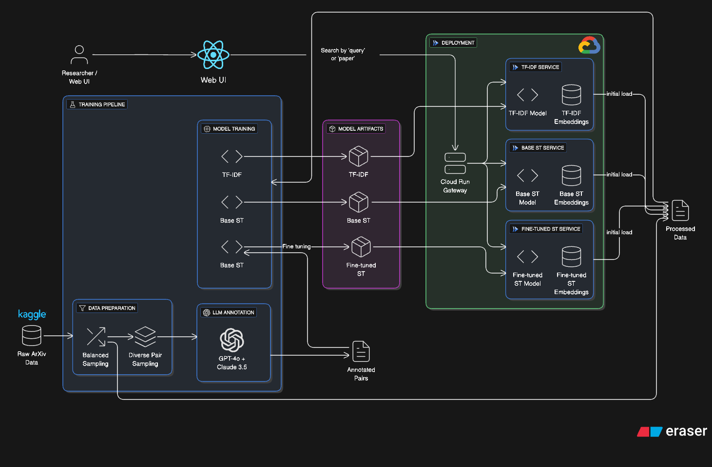

# Scholar Stream: Research Paper Recommendation Service

A production-ready research paper recommendation system built on the ArXiv dataset. The service supports multiple recommendation models (TF-IDF, Sentence Transformer, Fine-tuned Sentence Transformer) and is designed for deployment on Google Cloud Run.

## Table of Contents

- [Overview](#overview)
- [Features](#features)
- [Architecture](#architecture)
- [Project Structure](#project-structure)
- [Design Decisions & Assumptions](#design-decisions--assumptions)
- [Getting Started](#getting-started)
- [Training Pipeline](#training-pipeline)
- [API Reference](#api-reference)
- [Deployment](#deployment)
- [Evaluation](#evaluation)
- [Contributing](#contributing)

---

## Overview

Scholar Stream enables researchers to discover relevant academic papers through semantic search and recommendations. Given a query or a paper of interest, the system finds the most similar papers from a corpus of 100,000 ArXiv papers.

### Key Capabilities

- **Semantic Search**: Find papers by natural language queries
- **Paper Recommendations**: Get similar papers based on a selected paper
- **Multiple Models**: Compare TF-IDF baseline vs. neural embeddings
- **Production-Ready API**: RESTful endpoints with pagination and error handling

---

## Features

| Feature | Description |
|---------|-------------|
| **TF-IDF Model** | Fast, interpretable baseline using term frequency vectors |
| **Sentence Transformer** | Dense embeddings using `all-MiniLM-L6-v2` (384 dimensions) |
| **Fine-tuned Model** | Domain-adapted embeddings trained on LLM-annotated paper pairs |
| **LLM Annotation** | Dual-LLM scoring (GPT-4o + Claude 3.5 Haiku) for training data |
| **Comprehensive Eval** | Precision, Recall, MRR, MAP, nDCG metrics with LLM judges |

---

## Architecture



**Why separate services?**
- Smaller Docker images = faster cold starts
- Independent scaling per model
- Model updates don't affect other services
- Memory isolation (TF-IDF needs less than ST)

---

## Project Structure

```
research-paper-recommendation-service/
├── api/                              # API services
│   ├── gateway/                      # Request router
│   │   ├── main.py
│   │   └── Dockerfile
│   ├── services/
│   │   ├── tfidf/                    # TF-IDF service
│   │   ├── sentence_transformer/     # Base ST service
│   │   └── finetuned/                # Fine-tuned service
│   ├── shared/                       # Shared models & utils
│   └── requirements.txt
│
├── config/                           # Configuration files
│   ├── data_config.yaml              # Data paths & params
│   └── model_config.yaml             # Model hyperparameters
│
├── data/
│   ├── raw/                          # Raw ArXiv JSON
│   ├── processed/                    # Processed parquet
│   └── annotated/                    # LLM annotations
│
├── models/                           # Trained model artifacts
│   ├── tfidf/
│   ├── sentence_transformer/
│   └── finetuned_st/
│
├── notebooks/                        # Exploration notebooks
│   ├── baseline.ipynb
│   └── 02.Fine_tuning_sentence_transformer_03.ipynb
│
├── scripts/                          # Pipeline scripts
│   ├── prepare_data.py
│   ├── generate_annotations.py
│   ├── train_models.py
│   └── run_evaluation.py
│
├── src/                              # Core source code
│   ├── annotation/                   # LLM annotation
│   │   ├── pair_sampler.py
│   │   └── llm_scorer.py
│   ├── evaluation/                   # Evaluation metrics
│   │   └── evaluator.py
│   ├── models/                       # Model implementations
│   │   ├── tfidf/trainer.py
│   │   └── sentence_transformer/
│   │       ├── base_model.py
│   │       └── finetuner.py
│   ├── preprocessing/
│   │   └── data_loader.py
│   └── config.py                     # Configuration loader
│
├── docker-compose.yml                # Local development
├── cloudbuild.yaml                   # GCP Cloud Build
├── deploy.sh                         # Deployment script
├── Makefile                          # Task automation
└── requirements.txt                  # Python dependencies
```

---

## Design Decisions & Assumptions

### Data Processing

| Decision | Rationale |
|----------|-----------|
| **100K balanced sample** | Full dataset (~2M papers) is too large for quick iteration. Sampling ensures category diversity with max 2K papers per category. |
| **Primary category only** | Papers have multiple categories; using only the first simplifies grouping and evaluation. |
| **Title + Abstract as text** | Concatenating provides rich semantic content without full-text complexity. |

### Annotation Strategy

| Decision | Rationale |
|----------|-----------|
| **Dual-LLM scoring** | GPT-4o + Claude 3.5 Haiku provide diverse perspectives; averaging reduces bias. |
| **1-5 scoring scale** | More nuanced than binary; normalized to 0-1 for training. |
| **Diverse pair sampling** | 4 buckets (same category, same author, related category, random) ensure score distribution covers full range. |
| **10K pairs** | Balance between annotation cost and model performance. |

### Model Choices

| Decision | Rationale |
|----------|-----------|
| **TF-IDF baseline** | Fast, interpretable, no GPU needed. Good baseline for comparison. |
| **all-MiniLM-L6-v2** | Lightweight (22M params), fast inference, good quality. Suitable for CPU deployment. |
| **CosineSimilarityLoss** | Directly optimizes for similarity scores; matches our annotation format. |
| **CPU-only inference** | Reduces deployment cost; MiniLM is fast enough on CPU. |

### Deployment Architecture

| Decision | Rationale |
|----------|-----------|
| **Bake artifacts into images** | Eliminates GCS download latency on cold starts. Faster startup > smaller images. |
| **Separate images per model** | Independent scaling, smaller per-image size, isolated failures. |
| **Gateway routing** | Single entry point for UI; handles model selection logic. |
| **min-instances=0** | Cost optimization; accept ~5-10s cold starts vs. $30-50/month for warm instances. |
| **Cloud Run** | Serverless, auto-scaling, pay-per-request. Ideal for variable traffic. |

### Assumptions

1. **Dataset is static**: The 100K papers don't change frequently. Model retraining is manual.
2. **English papers only**: No multilingual support in current implementation.
3. **Single-user queries**: No personalization or user history.
4. **Moderate traffic**: Designed for ~1K requests/day, not high-volume production.

---

## Getting Started

### Prerequisites

- Python 3.11+
- Docker (for containerized deployment)
- Google Cloud SDK (for GCP deployment)
- Kaggle account (for dataset download)

### Installation

```bash
# Clone repository
git clone <repository-url>
cd research-paper-recommendation-service

# Create virtual environment
python -m venv venv
source venv/bin/activate  # or `venv\Scripts\activate` on Windows

# Install dependencies
pip install -r requirements.txt

# Set up environment variables
cp .env.example .env
# Edit .env with your API keys:
#   LLM_API_KEY=your-openai-api-key
#   LLM_BASE_URL=https://api.openai.com/v1
#   GPT_4O=gpt-4o
#   CLAUDE_3_5_HAIKU=claude-3-5-haiku-20241022
```

### Quick Start

```bash
# 1. Prepare data (downloads from Kaggle if needed)
make data

# 2. Train baseline models
make train

# 3. Start API locally
make api-tfidf  # In terminal 1
make api-st     # In terminal 2 (optional)
make api-gateway  # In terminal 3

# 4. Test API
curl "http://localhost:8000/api/v1/scholar-stream/search?q=machine+learning&model=tfidf&limit=3"
```

---

## Training Pipeline

### Full Pipeline

```bash
# Run complete pipeline
make all
```

This executes:
1. `make data` - Download and prepare 100K balanced dataset
2. `make train` - Train TF-IDF and Sentence Transformer models
3. `make annotate` - Generate LLM annotations (requires API keys)
4. `make finetune` - Fine-tune Sentence Transformer
5. `make eval` - Run evaluation

### Individual Steps

```bash
# Data preparation
make data

# Train baseline models only
make train

# Generate annotations (requires LLM API keys)
make annotate

# Fine-tune on annotations
make finetune

# Run evaluation
make eval
```

### Output Artifacts

```
data/
├── processed/index_100k.parquet     # 100K papers
└── annotated/training_pairs_10k.csv # LLM-scored pairs

models/
├── tfidf/
│   ├── vectorizer.joblib            # Fitted TF-IDF
│   └── embeddings.joblib            # Sparse matrix
├── sentence_transformer/
│   └── embeddings.npy               # Dense embeddings (100K × 384)
└── finetuned_st/
    ├── model/                       # Fine-tuned weights
    └── embeddings.npy               # Fine-tuned embeddings
```

---

## API Reference

### Base URL

```
http://localhost:8000/api/v1
```

### Endpoints

#### Search Papers

```http
GET /scholar-stream/search?q={query}&model={model}&page={page}&limit={limit}
```

| Parameter | Type | Required | Default | Description |
|-----------|------|----------|---------|-------------|
| `q` | string | No | - | Search query |
| `model` | string | Yes | - | `tfidf`, `base_transformer`, or `fine_tuned_transformer` |
| `page` | int | No | 1 | Page number |
| `limit` | int | No | 6 | Results per page (max 50) |

#### Get Recommendations

```http
GET /scholar-stream/recommendations?paper_id={id}&model={model}&limit={limit}
```

| Parameter | Type | Required | Default | Description |
|-----------|------|----------|---------|-------------|
| `paper_id` | string | Yes | - | ArXiv paper ID |
| `model` | string | Yes | - | Recommendation model |
| `limit` | int | No | 3 | Number of recommendations (max 20) |

#### Get Paper Details

```http
GET /scholar-stream/paper/{paper_id}
```

### Response Format

```json
{
  "success": true,
  "data": {
    "papers": [
      {
        "id": "2103.15538",
        "title": "Attention Is All You Need",
        "authors": ["Ashish Vaswani", "Noam Shazeer"],
        "abstract": "The Transformer architecture...",
        "categories": ["cs.CL", "cs.LG"],
        "similarity_score": 0.89
      }
    ],
    "pagination": {
      "current_page": 1,
      "total_pages": 15,
      "total_results": 89,
      "has_next": true
    }
  }
}
```

### Testing the API (curl commands)

#### Health Checks

```bash
# Gateway health
curl http://localhost:8000/health

# Individual service health (when running locally)
curl http://localhost:8001/health  # TF-IDF
curl http://localhost:8002/health  # Sentence Transformer
curl http://localhost:8003/health  # Fine-tuned
```

#### Search Papers

```bash
# Search with TF-IDF model
curl "http://localhost:8000/api/v1/scholar-stream/search?q=machine+learning&model=tfidf&limit=5"

# Search with base Sentence Transformer
curl "http://localhost:8000/api/v1/scholar-stream/search?q=machine+learning&model=base_transformer&limit=5"

# Search with fine-tuned Sentence Transformer
curl "http://localhost:8000/api/v1/scholar-stream/search?q=machine+learning&model=fine_tuned_transformer&limit=5"

# Search with pagination
curl "http://localhost:8000/api/v1/scholar-stream/search?q=neural+networks&model=tfidf&page=2&limit=10"

# Search without query (returns random/default results)
curl "http://localhost:8000/api/v1/scholar-stream/search?model=tfidf&limit=5"

# Complex query with special characters (URL encoded)
curl "http://localhost:8000/api/v1/scholar-stream/search?q=deep+learning+for+natural+language+processing&model=base_transformer&limit=3"
```

#### Get Recommendations

```bash
# Recommendations using TF-IDF
curl "http://localhost:8000/api/v1/scholar-stream/recommendations?paper_id=0704.0001&model=tfidf&limit=5"

# Recommendations using base Sentence Transformer
curl "http://localhost:8000/api/v1/scholar-stream/recommendations?paper_id=0704.0001&model=base_transformer&limit=5"

# Recommendations using fine-tuned model
curl "http://localhost:8000/api/v1/scholar-stream/recommendations?paper_id=0704.0001&model=fine_tuned_transformer&limit=5"

# Get more recommendations
curl "http://localhost:8000/api/v1/scholar-stream/recommendations?paper_id=0704.0001&model=tfidf&limit=20"
```

#### Get Paper Details

```bash
# Get details for a specific paper
curl "http://localhost:8000/api/v1/scholar-stream/paper/0704.0001"

# Another paper
curl "http://localhost:8000/api/v1/scholar-stream/paper/0704.0002"
```

#### Error Cases

```bash
# Invalid model (should return 400)
curl "http://localhost:8000/api/v1/scholar-stream/search?q=test&model=invalid_model"

# Missing required parameter (should return 422)
curl "http://localhost:8000/api/v1/scholar-stream/search?q=test"

# Non-existent paper (should return 404)
curl "http://localhost:8000/api/v1/scholar-stream/paper/9999.9999"

# Invalid paper_id format
curl "http://localhost:8000/api/v1/scholar-stream/recommendations?paper_id=invalid&model=tfidf&limit=5"
```

#### Direct Backend Service Calls (bypassing gateway)

```bash
# TF-IDF service directly
curl "http://localhost:8001/scholar-stream/search?q=quantum+computing&model=tfidf&limit=3"
curl "http://localhost:8001/scholar-stream/recommendations?paper_id=0704.0001&model=tfidf&limit=3"
curl "http://localhost:8001/scholar-stream/paper/0704.0001"

# Sentence Transformer service directly
curl "http://localhost:8002/scholar-stream/search?q=quantum+computing&model=base_transformer&limit=3"
curl "http://localhost:8002/scholar-stream/recommendations?paper_id=0704.0001&model=base_transformer&limit=3"

# Fine-tuned service directly
curl "http://localhost:8003/scholar-stream/search?q=quantum+computing&model=fine_tuned_transformer&limit=3"
curl "http://localhost:8003/scholar-stream/recommendations?paper_id=0704.0001&model=fine_tuned_transformer&limit=3"
```

#### Pretty-print JSON responses

```bash
# Use jq for formatted output
curl -s "http://localhost:8000/api/v1/scholar-stream/search?q=machine+learning&model=tfidf&limit=2" | jq .

# Or use Python
curl -s "http://localhost:8000/api/v1/scholar-stream/search?q=machine+learning&model=tfidf&limit=2" | python -m json.tool
```

---

## Deployment

### Local Development (Docker)

```bash
# Build all images
make api-build

# Start all services
make api-up

# View logs
docker-compose logs -f

# Stop services
make api-down
```

### Google Cloud Run Deployment

#### Prerequisites

1. Google Cloud project with billing enabled
2. Cloud Run and Container Registry APIs enabled
3. `gcloud` CLI authenticated

#### Deploy

```bash
# Set your project
export PROJECT_ID=your-gcp-project-id
export REGION=asia-south1

# Deploy all services
make deploy
```

This will:
1. Build and push Docker images to Google Container Registry
2. Deploy 4 Cloud Run services (gateway + 3 backends)
3. Configure gateway with backend URLs
4. Output the public gateway URL

#### Manual Deployment

```bash
# Build and push individual service (from project root)
gcloud builds submit \
  --tag gcr.io/$PROJECT_ID/scholar-stream-tfidf \
  api/services/tfidf/Dockerfile

# Deploy to Cloud Run
gcloud run deploy scholar-stream-tfidf \
  --image gcr.io/$PROJECT_ID/scholar-stream-tfidf \
  --platform managed \
  --region $REGION \
  --memory 1Gi \
  --allow-unauthenticated \
  --project $PROJECT_ID
```

### Cost Estimates (Cloud Run)

| Configuration | Monthly Cost (1K req/day) |
|---------------|---------------------------|
| min-instances=0 (cold starts) | ~$5-15 |
| min-instances=1 (always warm) | ~$50-80 |

---

## Evaluation

### Metrics

| Metric | Description |
|--------|-------------|
| **Precision@K** | Fraction of top-K results that are relevant (score ≥ 3) |
| **Recall@K** | Fraction of relevant items found in top-K |
| **MRR** | Mean Reciprocal Rank of first relevant result |
| **MAP@K** | Mean Average Precision at K |
| **nDCG@K** | Normalized Discounted Cumulative Gain |
| **Category Consistency** | % of recommendations in same category |

### Run Evaluation

```bash
# Evaluate with default settings (20 samples, top-10)
make eval

# Custom evaluation
python -m scripts.run_evaluation --n_samples 50 --top_k 5
```

### Expected Results

| Model | Precision@10 | nDCG@10 | MRR |
|-------|-------------|---------|-----|
| TF-IDF | ~0.70 | ~0.85 | ~0.90 |
| Base ST | ~0.75 | ~0.88 | ~0.92 |
| Fine-tuned ST | ~0.80 | ~0.91 | ~0.95 |

---

## Contributing

1. Fork the repository
2. Create a feature branch (`git checkout -b feature/amazing-feature`)
3. Commit changes (`git commit -m 'Add amazing feature'`)
4. Push to branch (`git push origin feature/amazing-feature`)
5. Open a Pull Request

---

## License

MIT License - see [LICENSE](LICENSE) for details.

---

## Acknowledgments

- [ArXiv Dataset](https://www.kaggle.com/Cornell-University/arxiv) by Cornell University
- [Sentence Transformers](https://www.sbert.net/) library
- [FastAPI](https://fastapi.tiangolo.com/) framework
